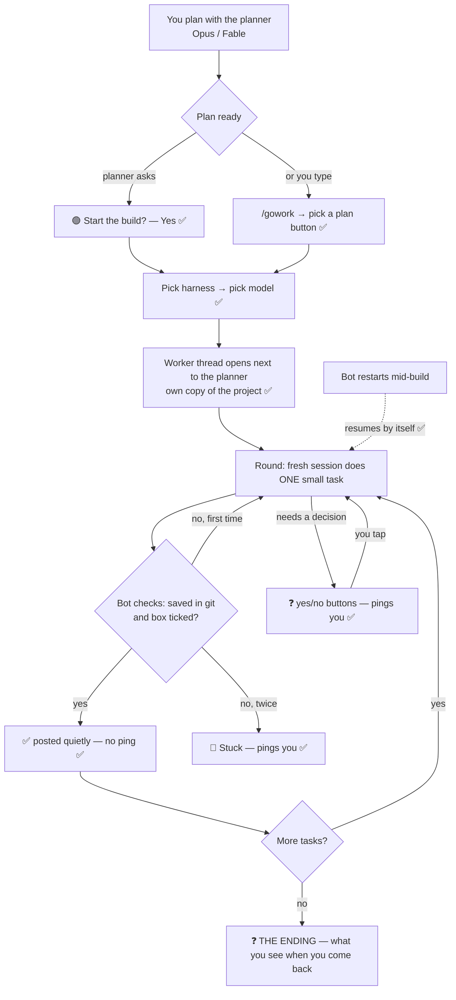

# /gowork: how it works, start to finish

The decisions made so far are marked ✅. The part still open is marked ❓.

## ❓ The ending, as your journey after the build

What you need at the end is to **see it working and test it without reading much**. A "merge?" question
doesn't give you that. The idea is a **Try-it card** at the top of the planner thread:

> **🧪 realpage QA fixes are ready to try** (12 of 12 tasks done)
> **Open it:** http://localhost:8765 ← a local copy is already running with the new work
> **Check these 3 things (30 seconds):**
> 1. Shrink the window to phone size: the table fits, with no sideways scrolling.
> 2. Click "Junction 15": the website link opens.
> 3. Ask the chatbot "which buildings use Yardi?": you get an answer with sources.
>
> [ ✅ Looks good, keep it ] [ ❌ Something's off ] [ 📋 What changed (short) ]

- **✅ Looks good:** the work is combined into the project. Going live (a push or deploy) is still its own yes/no.
- **❌ Something's off:** you type or say what's wrong in one line. That becomes a new small task, and the worker fixes it and gives you a fresh card.
- **Where the check list comes from:** the planner writes a "How to try it" section into every plan (the command that starts the local copy, the address, and the 3 things to check), so the card is written before the work even starts.
- **Projects with no website to open** (for example this bot): "Open it" becomes "try `/gowork` in #test-channel", with the same 3-check format.
