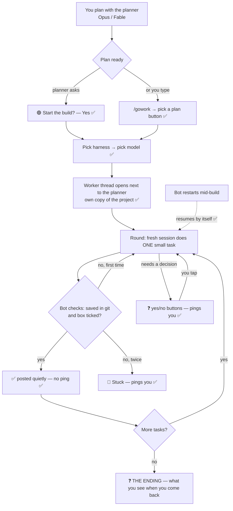

# /gowork: how it works, start to finish

The decisions made so far are marked ✅. The part still open is marked ❓.

## ❓ The ending, when you come back

You're away while it works. When you open Discord, you should be able to understand what happened in
10 seconds and deal with anything left in one tap. One option is a single **"Welcome back" card**
pinned at the top of the planner thread:

> **🏁 realpage QA — 12 of 12 done** (took 2 h 10 m, model: DeepSeek Pro)
> ✅ **Done:** fixed 9 layout bugs on phone, fixed 2 dead links, re-ran the QA sweep (clean).
> ⚠️ **Needs you:** nothing. *(Or: "1 question waiting: deploy to Railway?" with buttons right here)*
> 📦 **Your work:** already combined into the project and saved. *(No "merge?" question.)*
> [ See every task ] [ Undo the whole build ]

What that means:
- **No "merge?" question at the end.** When every check passed, the work is combined into the project automatically.
- **Nothing is final:** the undo button reverses the whole build in one tap.
- **Questions don't pile up in threads you'd have to hunt through:** they're collected on the card, right where you look first.
